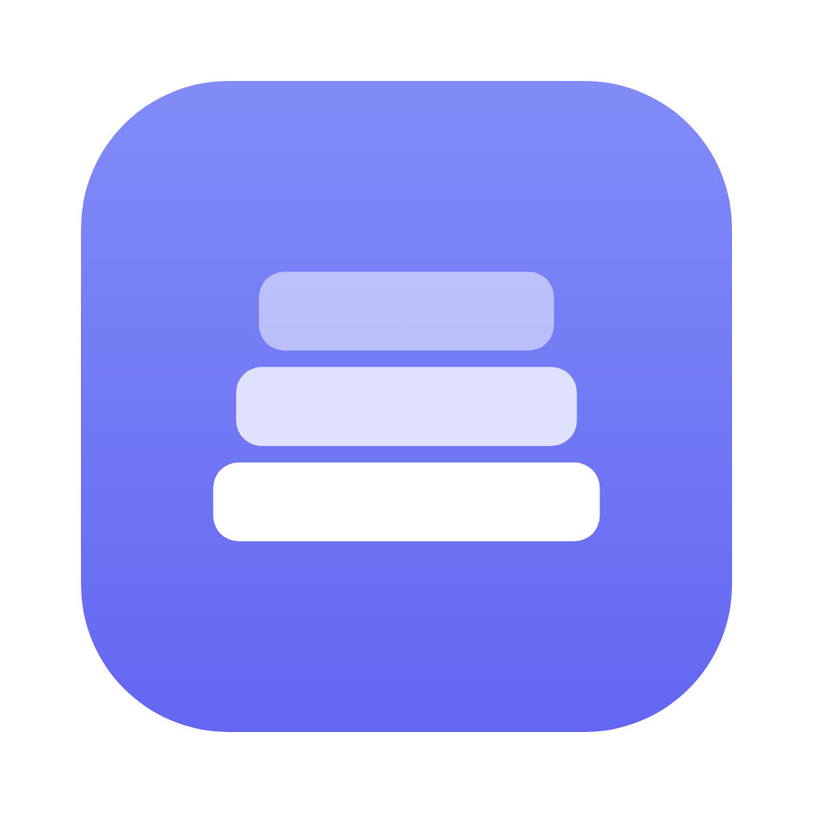

<p align="center">
  
</p>

<h1 align="center">Stackr</h1>

<p align="center">A focused, OmniFocus-style task manager — self-hosted, offline-capable, and packageable as a native macOS app.</p>

---

Stackr is **one Laravel app** that serves a **React + TypeScript SPA** over a same-origin REST API, with **Sanctum cookie auth** and **SQLite**. It ships as a web app, an installable **PWA**, and a standalone **macOS `.app`**.

## Features

- **Inbox → Projects → Tasks** with nested subtasks, drag-and-drop reordering
- **Tags** (with colors), **Perspectives** (saved custom filters), **Review** mode
- **Defer / due dates**, **flags**, **priorities**, per-task **colors**, recurring tasks
- **Today / Forecast / Calendar / Flagged / Completed** views
- Full **Markdown** notes & comments
- **Natural-language quick add** (`Pay rent !high #home tomorrow`)
- **Multi-select bulk actions**, swipe gestures, mobile bottom-sheet
- **Dark mode**, keyboard shortcuts, timezone-aware dates
- **Real-time sync** across tabs (SSE), **web push** due reminders
- **Export / Import** JSON backups, first-run **setup wizard**
- **Standalone macOS app** (Electron + bundled static PHP) — see [`desktop.md`](desktop.md)

## Quick start

```bash
composer install
npm install && npm run build
php artisan key:generate
```

Then open the app — a **first-run setup wizard** creates the database, your account,
and optionally imports a backup. Full instructions in **[setup.md](setup.md)**.

Runs great under [DDEV](https://ddev.com): `ddev start` → `npm run build` → open `https://<project>.ddev.site`.

## Desktop app (macOS)

A double-clickable `.app`/`.dmg` that bundles PHP + SQLite and needs no server.
See **[desktop.md](desktop.md)**. Pre-built DMGs are attached to
[Releases](../../releases).

## Tech

Laravel · React 19 + TypeScript + Vite · TanStack Query · Zustand · dnd-kit ·
Tailwind · SQLite · Sanctum · Electron + static-php-cli

## License

MIT
